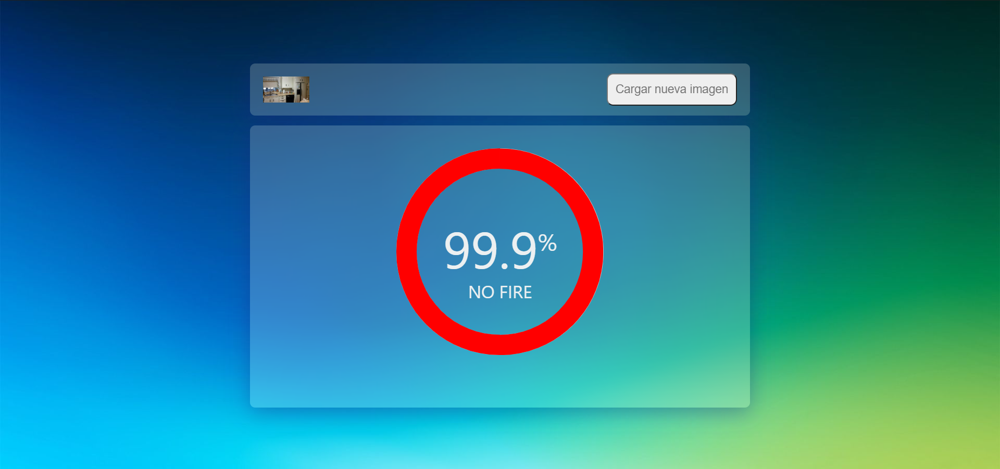

# Detección de Incendios (front)

Interfáz gráfica para probar el modelo creado de una red neuronal convolucional que se encargue de analizar y clasificar imágenes de los distintos lugares de una vivienda, de tal manera que se logra detectar patrones que indiquen un posible incendio.

# Link de la web

```sh
http://deteccionideincendios.s3-website-us-east-1.amazonaws.com/
```

# Pre-requisitos

- Node. js 10.16.0

# Instalación

1. Clone el repo.

```sh
git clone https://github.com/DeteccionDeIncendios/front.git
```

2. Instale Frontend NPM packages.

```sh
cd front
npm install
```

# Ejecución

1. Ejecute:

```sh
npm start
```

2. Visualice en el navegador:

```sh
http://localhost:3000/
```

# Uso

1. En la pantalla principal se observa un drag y dos botones, aqui se puede arrastrar una imagen de formato jpg/jpeg o cargar una imagen dando click en el botón "Cargar Imagen".
   
2. Una vez cargada la imagen se puede cambiar por otra o mandarla a procesar dendole click en el botón "Procesar".
   
3. Se procesará la imagen y se mostrará una respuesta similar a esta, indicando la probabilidad de que en esa imagen exista fuego.
   

- En el caso que no presentara fuego, saldría un resultado semejante al siguiente:
  

* Igualmente presenta la probabilidad, pero esta vez de no haber fuego.
